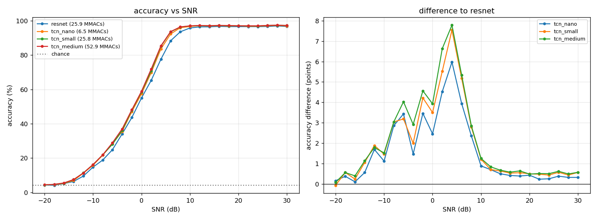
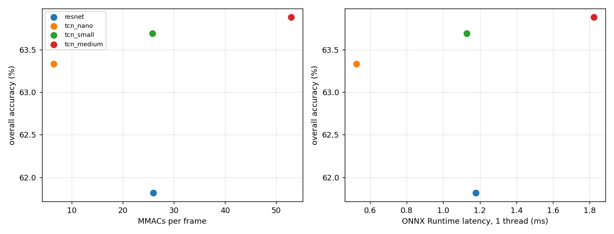

# Modulation Classification with TCN

This repository provides a thorough comparison between a 1D Residual Network (ResNet) baseline and scalable Temporal Convolutional Networks (TCNs) for Automatic Modulation Classification (AMC) using raw I/Q frames from the RadioML 2018.01A dataset.

Standard 1D CNNs typically have narrow observation windows unless heavily downsampled, while recurrent models (RNN/LSTM) struggle with parallel throughput on streaming data. In contrast, this project leverages the inherent parallel processing capability of dilated depthwise-separable convolutions to cover the entire 1024-sample frame efficiently while keeping inference fast on CPU. A modernized 1D ResNet (adapted from O'Shea et al., 2018 with BatchNorm and OneCycleLR) serves as the baseline.

---

## Dataset

Evaluated on the synthetic RadioML 2018.01A benchmark (`GOLD_XYZ_OSC.0001_1024.hdf5`):
* **Volume:** 2,555,904 total frames across 24 digital and analog modulation classes.
* **Frame format:** Shape `(2, 1024)` raw in-phase and quadrature (I/Q) components, normalized to unit frame RMS.
* **SNR coverage:** 26 discrete SNR levels from -20 dB to +30 dB in 2 dB steps (4,096 frames per class/SNR bin).
* **Splits:** 70% train (1,789,132), 15% validation (383,386), and 15% test (383,386), stratified across every (class, SNR) pair with a fixed seed (42).
* **Classes (24):** OOK, 4ASK, 8ASK, BPSK, QPSK, 8PSK, 16PSK, 32PSK, 16APSK, 32APSK, 64APSK, 128APSK, 16QAM, 32QAM, 64QAM, 128QAM, 256QAM, AM-SSB-WC, AM-SSB-SC, AM-DSB-WC, AM-DSB-SC, FM, GMSK, OQPSK.

---

## Benchmark Results

All models were trained for 20 epochs using AdamW, OneCycleLR, and FP16 precision. 

* **Test Environment & Hardware:** Inference latencies and compute benchmarks were executed on an **Intel(R) Xeon(R) CPU @ 2.20GHz** environment using FP32 precision, single thread (1-thread), and batch size = 1 via ONNX Runtime.

Raw tabular logs can be found in the `results/` folder.

| Model | Params | MMACs | Overall Acc | Acc (0 dB) | Acc (≥ +10 dB) | Latency (1-thread CPU) |
| :--- | :---: | :---: | :---: | :---: | :---: | :---: |
| **ResNet** (Baseline) | ~167k | 25.9 | 61.8% | 55.0% | 96.5% | 1.18 ms |
| **`tcn_nano`** | ~36k | **6.5** | **63.3%** | **57.5%** | **97.0%** | **0.53 ms** |
| **`tcn_small`** | ~139k | 25.8 | **63.7%** | **58.5%** | **97.1%** | **1.13 ms** |
| **`tcn_medium`** | ~283k | 52.9 | **63.9%** | **59.0%** | **97.2%** | 1.82 ms |

---

## Observations



* **Transition SNR (0 to +8 dB):** The temporal span provides the clearest advantage in this regime. At 0 dB, TCN variants pull ahead by 2.5 to 3.5 points, peaking around +4 dB with up to a **+7.8 percentage point gain** over ResNet as the network resolves symbol transitions through channel noise.
* **High SNR (≥ +10 dB):** Differences narrow down significantly; all architectures plateau around ~97% once channel conditions are clean.
* **Overall Accuracy Ceiling (~60-65%):** The metric averages all 26 SNR bins (-20 to +30 dB). In the extreme negative regime (-20 to -6 dB), signals are heavily noise-dominated, pulling down the global average despite near-perfect accuracy at high SNR.



* **Compute efficiency:** `tcn_nano` operates at 25% of ResNet’s compute load (6.5 MMACs) and cuts single-core CPU latency to ~0.53 ms while maintaining a +1.5% lead in overall accuracy.
* **Cost-Benefit Trade-off:** Scaling up from `tcn_small` to `tcn_medium` doubles the computational cost for a marginal +0.2% gain, making `tcn_nano` and `tcn_small` the much more practical choices for resource-constrained edge devices.
---

## Repository Structure

```text
tcn-modulation-classification/
├── figures/
│   ├── snr_curves.png              # Top-1 accuracy across SNRs and delta curves
│   ├── accuracy_vs_cost.png        # Accuracy vs. compute (MMACs) and CPU latency
│   ├── training_curves.png         # Loss and validation accuracy curves
│   ├── receptive_field.png         # Empirical gradient effective RF profiles
│   └── confusion.png               # High-SNR difference confusion matrix
├── onnx_models/                    # Exported ONNX inference graphs
│   ├── resnet.onnx
│   ├── tcn_nano.onnx
│   ├── tcn_small.onnx
│   └── tcn_medium.onnx
├── results/                        # Tabular benchmark metrics
│   ├── accuracy.csv
│   ├── latency.csv
│   ├── per_class_accuracy.csv
│   └── summary.csv
├── tcn_modulation_classification.ipynb   # End-to-end pipeline (training, profiling, export)
├── LICENSE
└── README.md
```

## Future Work

* **Modulation Error Diagnostics:** Analyzing common misclassifications across modulation families, such as analog variants and dense digital schemes.
* **Extended Training Schedules:** Testing longer training runs with multi-seed evaluations to check convergence stability.
